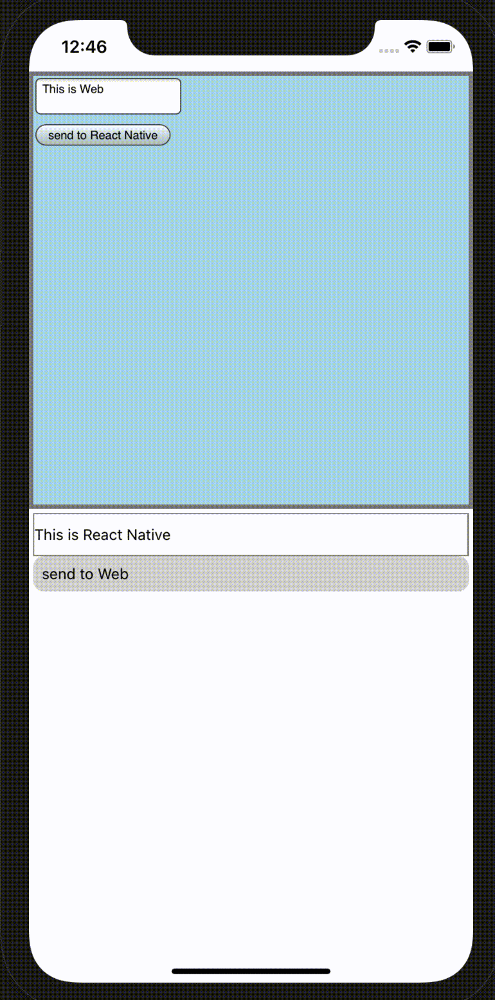
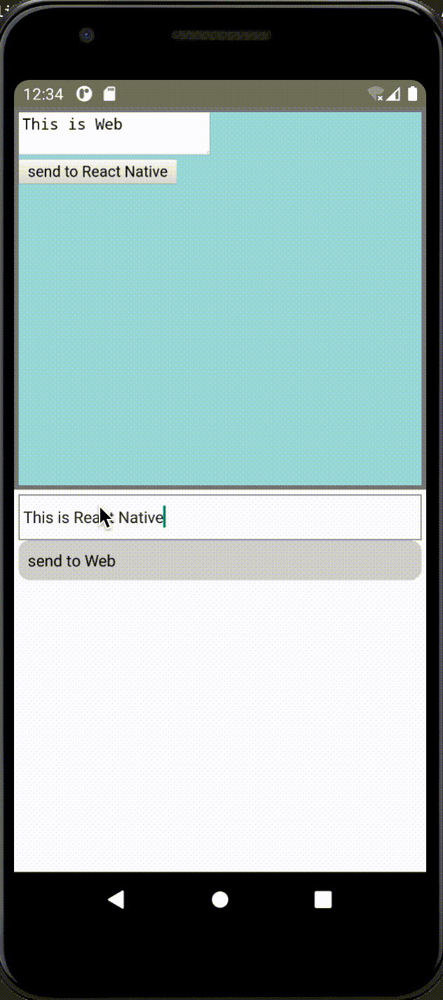

# react-native-react-bridge

  

An easy way to integrate your [React](https://github.com/facebook/react) (or [Preact](https://github.com/preactjs/preact)/[React Native Web](https://github.com/necolas/react-native-web)) app into [React Native](https://github.com/facebook/react-native) app with WebView.

> [!NOTE]
> You may also like [Expo DOM components](https://docs.expo.dev/guides/dom-components/)

## Why?

If you'd like to run your React web app in React Native, rewriting it for React Native or using [react-native-web](https://github.com/necolas/react-native-web) is preferred way in most cases.
But sometimes rewriting is overkill, when you are just prototyping, or when the app includes something not available on React Native, like rich text editor with contenteditable or complicated logic with WebAssembly.

So how we run React app in React Native app as it is? It's logically possible if you run your web code in WebView using [react-native-webview](https://github.com/react-native-webview/react-native-webview).
However bundling React code with React Native is troublesome and implementing communication between React Native and WebView is so hard.

This library gives a bridge to make it easy.
This will bundle the whole React app by some additional codes and it will be automatically re-compiled if you edit it.
You rarely need to think which code you are editing for React or React Native, like isomorphic.
The communication between React app and React Native app will be also simplified by this.

 

## Features

- Create React (or Preact/React Native Web) app bundle for WebView automatically in build process of React Native
  - All JS modules (with or without JSX/TypeScript) will be bundled with [esbuild](https://github.com/evanw/esbuild).
  - **NOTE: Only the edits in the entry file of web will invoke rebuild because of the limitation of [metro](https://github.com/facebook/metro)'s build process.**
- Handle communication between React Native and WebView with React hook style
  - With `useWebViewMessage` hook, you can subscribe messages from WebView sent with `emitToWebView`.
  - With `useNativeMessage` hook, you can subscribe messages from React Native sent with `emitToNative`.
- Support bundling some assets in web side with [ES6 import syntax](https://developer.mozilla.org/en-US/docs/Web/JavaScript/Reference/Statements/import)
  - `.json` is imported as an object, like require in Node.js.
  - `.txt` and `.md` are imported as string, like [raw-loader](https://github.com/webpack-contrib/raw-loader).
  - `.css` is injected to the HTML head of WebView, like [css-loader](https://github.com/webpack-contrib/css-loader) with [style-loader](https://github.com/webpack-contrib/style-loader).
  - `.bmp`, `.gif`, `.png`, `.jpg`, `.jpeg`, `.webp` and `.svg` are loaded as base64 encoded url, like [url-loader](https://github.com/webpack-contrib/url-loader).
  - `.htm` and `.html` are loaded as string, which can be rendered with React's [dangerouslySetInnerHTML](https://reactjs.org/docs/dom-elements.html#dangerouslysetinnerhtml).
  - `.wasm` is imported like [Node.js](https://nodejs.org/api/esm.html#esm_wasm_modules), which is compatible with [ES Module Integration Proposal for WebAssembly](https://github.com/WebAssembly/esm-integration).

If you have some feature requests or improvements, please create a [issue](https://github.com/inokawa/react-native-react-bridge/issues) or [PR](https://github.com/inokawa/react-native-react-bridge/pulls).

## Install

```sh
npm install react-native-react-bridge react-native-webview

# Necessary only if you render React app in WebView
npm install react-dom

# Necessary only if you render Preact app in WebView
# preact >= 10.0
npm install preact

# Necessary only if you render React Native Web app in WebView
npm install react-dom react-native-web
```

### Requirements

- react >= 16.14
- react-native >= 0.60

## Usage

### 1. Fix `metro.config.js` to use babelTransformer from this library.

#### React Native

```javascript
module.exports = {
  transformer: {
    // This detects entry points of React app and transforms them
    // For the other files this will switch to use default `metro-react-native-babel-transformer` for transforming
    babelTransformerPath: require.resolve('react-native-react-bridge/lib/plugin'),
    ...
  },
/*
  // optional config
  rnrb: {
    // Set `true` if you use Preact in web side.
    // This will alias imports from `react` and `react-dom` to `preact/compat` automatically.
    preact: true,
    // Set `true` if you use react-native-web in web side.
    // This will alias imports from `react-native` to `react-native-web` automatically.
    web: true
  },
*/
  ...
};
```

#### Expo

```javascript
const { getDefaultConfig } = require("expo/metro-config");

const config = getDefaultConfig(__dirname);

config.transformer.babelTransformerPath = require.resolve(
  "react-native-react-bridge/lib/plugin"
);

module.exports = config;
```

#### Projects with Multiple Transformers

If your project at some point requires a metro configuration with additional transformers, consider making a separate `customTransformer.js` file in the project root with logic for delegating files types to the appropriate transformer, and modifying `metro.config.js` file to reference the customer transformer file. For example, if you are using `react-native-svg-transformer`, this would be your custom transformer file:

```js
// root/customTransformer.js
const reactNativeReactBridgeTransformer = require("react-native-react-bridge/lib/plugin");
const svgTransformer = require("react-native-svg-transformer");

module.exports.transform = function ({ src, filename, options }) {
  if (filename.endsWith(".svg")) {
    return svgTransformer.transform({ src, filename, options });
  } else {
    return reactNativeReactBridgeTransformer.transform({
      src,
      filename,
      options,
    });
  }
};
```

And this would be your metro config:

```js
// root/metro.config.js
const { getDefaultConfig } = require("metro-config");

module.exports = (async () => {
  const {
    resolver: { sourceExts, assetExts },
  } = await getDefaultConfig();
  return {
    transformer: {
      babelTransformerPath: require.resolve("./customTransformer.js"),
    },
    resolver: {
      assetExts: assetExts.filter((ext) => ext !== "svg"),
      sourceExts: [...sourceExts, "svg"],
    },
  };
})();
```

#### Custom Esbuild options

To support custom Esbuild options, we can use Multiple Transformers method and replace the customTransformer.js file with the following code:

```tsx
// root/customTransformer.js
const reactNativeReactBridgeTransformer = require("react-native-react-bridge/lib/plugin");

const esbuildOptions = {
  pluglins: [],
};
const transform =
  reactNativeReactBridgeTransformer.createTransformer(esbuildOptions);

module.exports.transform = function ({ src, filename, options }) {
  return transform({ src, filename, options });
};
```

### 2. Make entry file for web app.

- If you use React, React Native Web or Preact with React alias, import modules `react-native-react-bridge/lib/web`.
- If you use Preact, import modules from `react-native-react-bridge/lib/web/preact`.

```jsx
// WebApp.js

import React, { useState } from "react";
import {
  webViewRender,
  emitToNative,
  useNativeMessage,
} from "react-native-react-bridge/lib/web";
// Importing css is supported
import "./example.css";
// Images are loaded as base64 encoded string
import image from "./foo.png";

const Root = () => {
  const [data, setData] = useState("");
  // useNativeMessage hook receives message from React Native
  useNativeMessage((message) => {
    if (message.type === "success") {
      setData(message.data);
    }
  });
  return (
    <div>
      
      <div>{data}</div>
      <button
        onClick={() => {
          // emitToNative sends message to React Native
          //   type: event name
          //   data: some data which will be serialized by JSON.stringify
          emitToNative({ type: "hello", data: 123 });
        }}
      />
    </div>
  );
};

// This statement is detected by babelTransformer as an entry point
// All dependencies are resolved, compressed and stringified into one file
export default webViewRender(<Root />);
```

### 3. Use the entry file in your React Native app with WebView.

```jsx
// App.js

import React from "react";
import WebView from "react-native-webview";
import { emitToWebView, useWebViewMessage } from "react-native-react-bridge";
import webApp from "./WebApp";

const App = () => {
  const ref = useRef(null);
  // useWebViewMessage hook create props for WebView and handle communication
  // The argument is callback to receive message from React
  const onMessage = useWebViewMessage((message) => {
    // emitToWebView sends message to React
    //   type: event name
    //   data: some data which will be serialized by JSON.stringify
    if (message.type === "hello" && message.data === 123) {
      emitToWebView(ref, { type: "success", data: "succeeded!" });
    }
  });

  return (
    <WebView
      // ref, source and onMessage must be passed to react-native-webview
      ref={ref}
      // Pass the source code of React app
      source={{ html: webApp }}
      onMessage={onMessage}
    />
  );
};
```

### 4. Start your React Native app!

## Documentation

- [API reference](./docs/API.md)

### FAQs

#### My webview displays a blank page.

react-native-webview has some ways to show errors occurred in webview. This may be helpful to troubleshoot it.

https://github.com/react-native-webview/react-native-webview/blob/master/docs/Reference.md#onerror

## Demo

This repository includes demo app.

```sh
git clone git@github.com:inokawa/react-native-react-bridge.git
cd examples/DemoApp
npm install
npm run ios # or npm run android
```

## Contribute

All contributions are welcome.
If you find a problem, feel free to create an [issue](https://github.com/inokawa/react-native-react-bridge/issues) or a [PR](https://github.com/inokawa/react-native-react-bridge/pulls).

### Making a Pull Request

1. Fork this repo.
2. Run `npm install`.
3. Commit your fix.
4. Add tests to cover the fix.
5. Make a PR and confirm all the CI checks passed.
